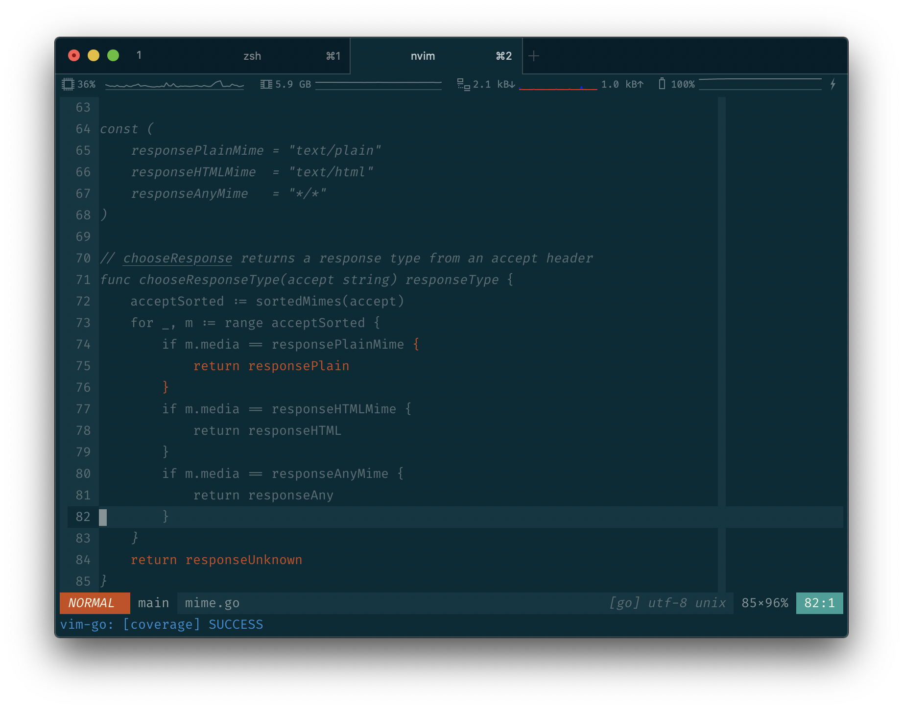
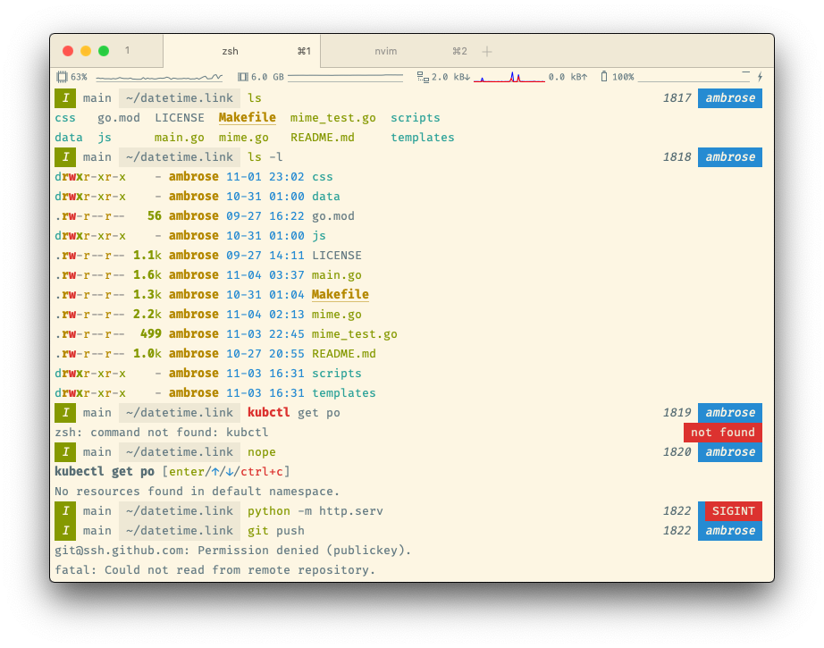

# env [](https://ci.makerforce.io/ambrose/env)

Just storing dotfiles in a repository isn't enough. This is almost all the tools I use, put into a Docker image that I can run anywhere

## Screenshots






## Usage

### Docker

```sh
export PATH="$HOME/.local/bin:$PATH"
curl -fLo ~/.local/bin/contain https://raw.githubusercontent.com/serverwentdown/env/master/.local/bin/contain
chmod +x ~/.local/bin/contain
contain -h
```

### macOS, Fedora, Alpine, Ubuntu, Debian

[Install yadm](https://yadm.io/docs/install), and then clone.

```sh
# Install yadm (macOS)
brew install yadm
# Install yadm (dirty method)
sudo curl -fLo /usr/local/bin/yadm https://github.com/TheLocehiliosan/yadm/raw/master/yadm
sudo chmod +x /usr/local/bin/yadm
# Clone
yadm clone git@github.com:serverwentdown/env.git
```

## Optional

```sh
git clone git@makerforce.io:ambrose/pass.git ~/.password-store
```

### GNOME Keyboard

First, copy the custom layout:

```
cp ~/.xkb/symbols/ambrose /usr/share/X11/xkb/symbols/ambrose
```

Then, open `/usr/share/X11/xkb/rules/evdev.xml` in an editor and add this block in `<layoutList>`:

```
    <layout>
      <configItem>
        <name>ambrose</name>
        <shortDescription>amb</shortDescription>
        <description>English (Ambrose)</description>
        <languageList>
          <iso639Id>eng</iso639Id>
        </languageList>
      </configItem>
      <variantList>
        <variant>
          <configItem>
            <name>dvp</name>
            <description>English (Ambrose, Programmer Dvorak)</description>
          </configItem>
        </variant>
        <variant>
          <configItem>
            <name>basic</name>
            <description>English (Ambrose, Qwerty)</description>
          </configItem>
        </variant>
      </variantList>
    </layout>
```
