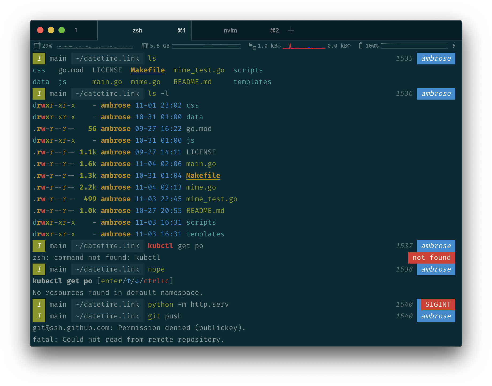

# env [](https://ci.makerforce.io/ambrose/env)

Just storing dotfiles in a repository isn't enough. This is almost all the tools I use, put into a Docker image that I can run anywhere

## Screenshots





## Usage

### Docker

```sh
export PATH="$HOME/.local/bin:$PATH"
curl -fLo ~/.local/bin/runenv https://raw.githubusercontent.com/serverwentdown/env/master/.local/bin/runenv
chmod +x ~/.local/bin/runenv
runenv -h
```

### macOS

```sh
brew install \
	xz upx \
	\
	zsh-autosuggestions \
	zsh-syntax-highlighting \
	exa jq \
	neovim \
	\
	git \
	pass gnupg \
	\
	python@3.9 \
	go \
	\
	thefuck \
	httpie \
	dust \
	yadm \
	\
	kubectl \
	minio/stable/mc

yadm clone git@github.com:serverwentdown/env.git
```

## Optional

```sh
# requires private key
yadm decrypt
# requires yadm decrypt
git clone git@makerforce.io:ambrose/pass.git ~/.password-store
```
